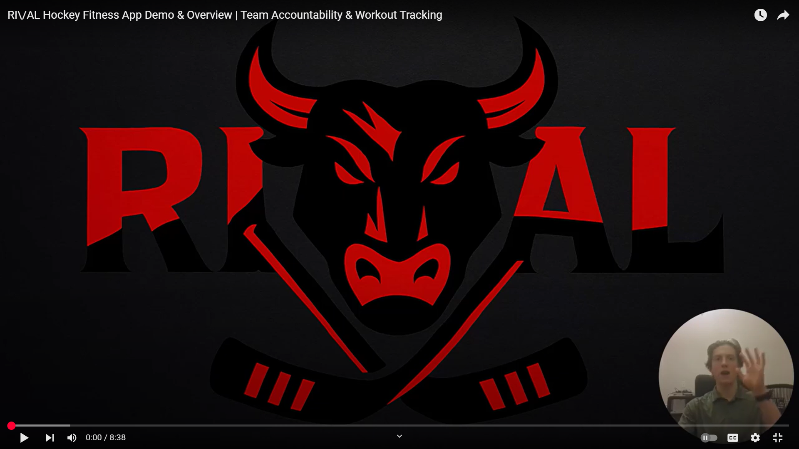

# HockeyFitnessApp

Ri\\/aL is a mobile app for hockey teams and groups to stay in shape and connected during the offseason. Players log workouts, coaches track progress, and teams compete on leaderboards to stay accountable and motivated. Groups of motivated teammates can also join without a coach to create their own accountability channels.

[](https://www.youtube.com/watch?v=FeUi4ICUFho)

## Hockey Accountability App

A React Native Expo application for hockey team accountability, featuring coach and player dashboards, workout logging, and team leaderboards.

## 🚀 Getting Started


### Prerequisites

- Node.js (v16 or higher)
- npm or yarn
- Expo CLI (optional). Install globally with `npm install -g expo-cli` or run `npx expo` without global install.
- Firebase project with Authentication, Firestore, and Storage enabled

### Setup Instructions

1. **Clone the repository**
  ```bash
  git clone https://github.com/Mr-Methodical/HockeyFitnessApp.git
  cd HockeyFitnessApp
  ```

2. **Install dependencies**
  ```bash
  npm install
  ```


3. **Firebase & OpenAI API Configuration**
- Copy `.env.example` to `.env` in the project root (see `.env.example` for required keys):
  ```bash
  # macOS / Linux
  cp .env.example .env
  # Windows (PowerShell)
  copy .env.example .env
  ```

Open `.env` and add your keys:

```env
FIREBASE_API_KEY=...
FIREBASE_AUTH_DOMAIN=...
FIREBASE_PROJECT_ID=...
FIREBASE_STORAGE_BUCKET=...
FIREBASE_MESSAGING_SENDER_ID=...
FIREBASE_APP_ID=...
OPENAI_API_KEY=...   # only required if using AI features
```

Do not commit `.env`.

**Do not edit `src/services/firebase.js` or `src/services/aiWorkout.js` directly for API keys. Use the `.env` file for all secrets.**


4. **Start the development server**
  ```bash
  npx expo start
  ```

This will start the Expo development server. You can then:
- Press `i` for iOS simulator
- Press `a` for Android emulator
- Press `w` for web
- To test on a phone, install Expo Go and scan the QR code


## Features

### 🏒 For Coaches
- Create and manage teams
- View all player workout logs
- Track team statistics and progress
- Generate team codes for player invitations

### 👥 For Players
- Join teams using team codes
- Log workouts with photos and details
- View team leaderboards
- Track personal workout statistics


## Tech Stack

- **Frontend**: React Native with Expo
- **Backend**: Firebase (Authentication, Firestore, Storage)
- **Navigation**: React Navigation
- **State Management**: React Context API


## Firestore & Storage Security Rules

### Firestore
Set up the following Firestore security rules:


```javascript
rules_version = '2';
service cloud.firestore {
  match /databases/{database}/documents {
    // Users can read/write their own user document
    match /users/{userId} {
      allow read, write: if request.auth != null && request.auth.uid == userId;
    }
    // Team members can read team data
    match /teams/{teamId} {
      allow read: if request.auth != null;
      allow write: if request.auth != null && 
        get(/databases/$(database)/documents/users/$(request.auth.uid)).data.role == 'coach';
    }
    // Team members can read workouts, users can create their own
    match /workouts/{workoutId} {
      allow read: if request.auth != null;
      // use request.resource to validate incoming write data (resource doesn't exist yet)
      allow create: if request.auth != null && request.resource.data.userId == request.auth.uid;
    }
  }
}
```

Note: Test these rules with the Firebase emulator before deploying.

### Storage
```javascript
rules_version = '2';
service firebase.storage {
  match /b/{bucket}/o {
    // All workout images (regular workouts and AI workouts) use this path
    match /workouts/{userId}/{allPaths=**} {
      allow read, write: if request.auth != null && request.auth.uid == userId;
    }
  }
}
```


## Project Structure

```
src/
├── components/          # Reusable UI components
├── navigation/          # Navigation setup
├── screens/             # App screens (Login, Signup, Dashboards, Leaderboard, LogWorkout, Profile, Team Management, etc.)
├── services/            # Firebase and backend services
└── utils/               # Utilities and context providers
```


## Database Schema

### Collections

#### `users`
```javascript
{
  email: string,
  name: string,
  role: 'coach' | 'player',
  teamId: string | null,
  createdAt: timestamp
}
```

#### `teams`
```javascript
{
  name: string,
  code: string,
  coachId: string,
  createdAt: timestamp
}
```

#### `workouts`
```javascript
{
  userId: string,
  teamId: string,
  type: string,
  duration: number,
  notes: string,
  imageUrl: string | null,
  timestamp: timestamp,
  createdAt: timestamp
}
```


## Next Steps

### Planned Features
- [ ] Push notifications for team updates
- [ ] Workout type categories and templates
- [ ] Monthly/weekly challenges
- [ ] Export workout data
- [ ] Expand for other sports

## Contributing

1. Fork the repository
2. Create a feature branch
3. Make your changes
4. Test thoroughly
5. Submit a pull request

## License

This project is licensed under the MIT License.
